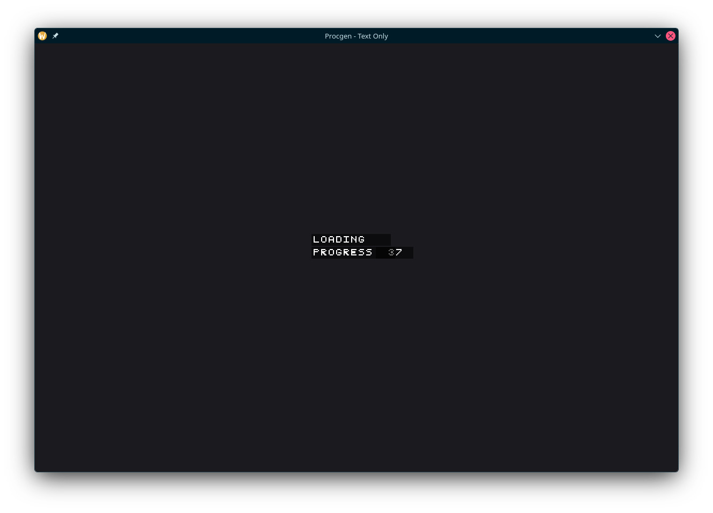
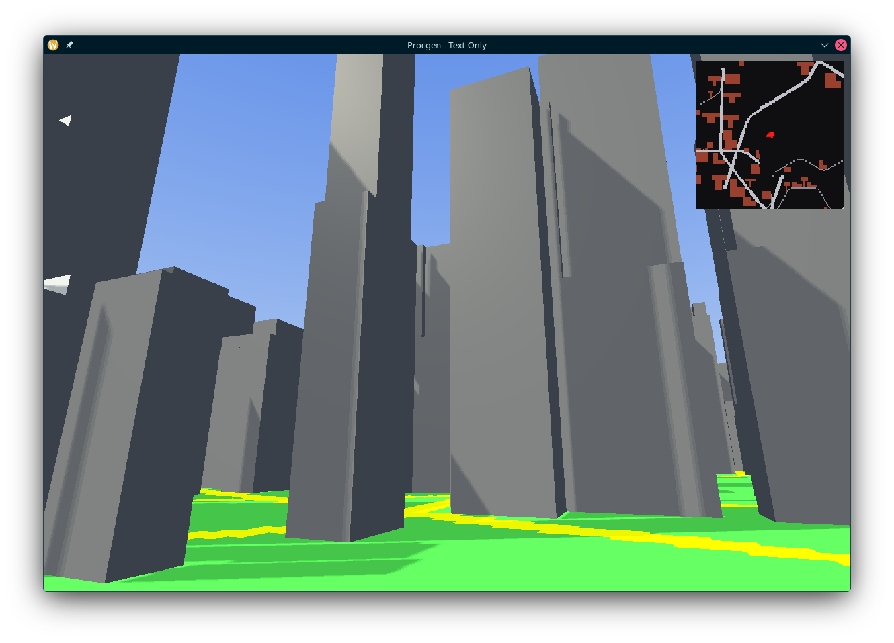
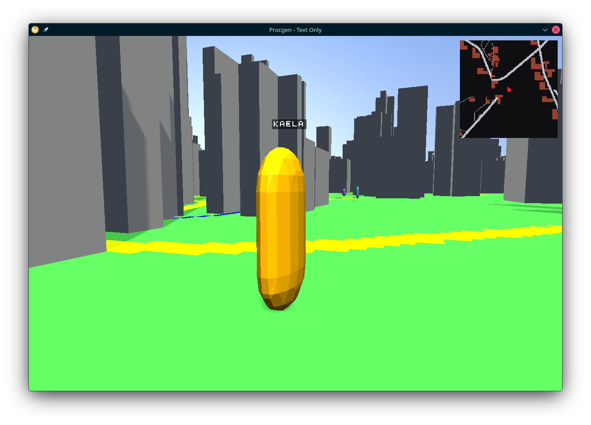
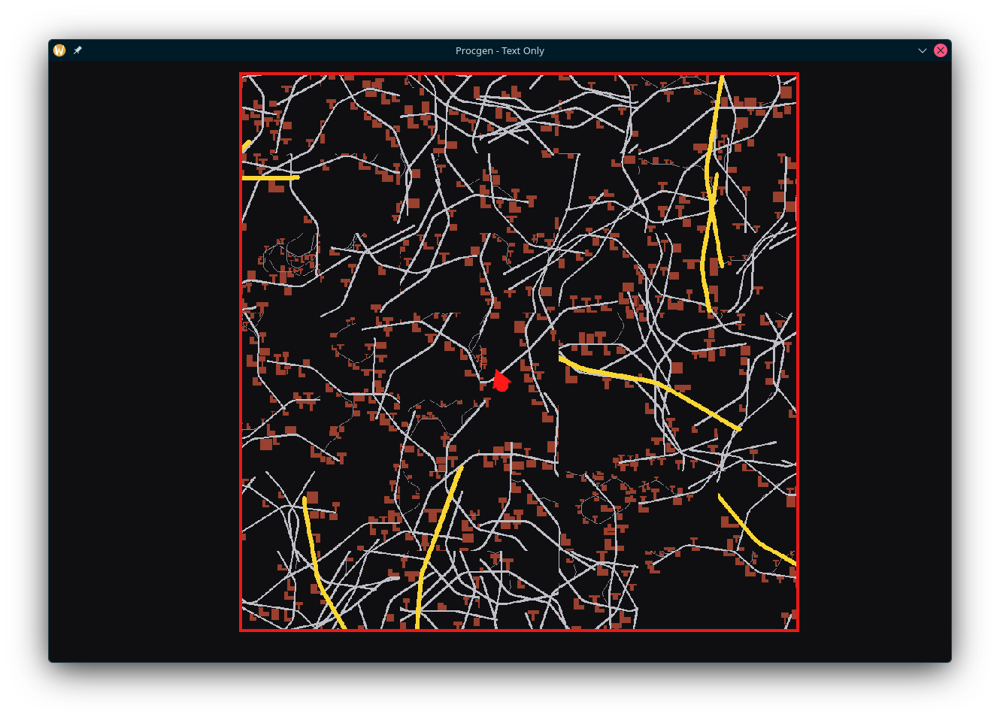

# PRPG

PRPG (Procedural RPG) is a small C++ project demonstrating procedural generation, rendering, and lightweight LLM integration for in-game behaviors. It's intended as a prototype and research playground for procedural world generation, NPC behaviors, and integration with local model runtimes.

**Table of contents**

- What it is
- Current features
- Planned features
- Technologies
- Screenshots
- Build
- Run
- Configuration
- Contributing
- License & contact

## What it is

PRPG is a prototype application that generates procedural roads, terrain and simple city elements, renders them with OpenGL, and experiments with local LLM integration (via `llama`/`ggml`) for NPC/dialogue behaviors. The repository includes example models and assets under `src/models` and `src/assets`.

## Current features

- Procedural road / terrain generation utilities
- Deferred OpenGL renderer and skybox
- Basic entity system including `player` and `npc` entities
- Asset loaders for images, glTF models and simple shaders
- Optional local model support using `llama` / `ggml` (model files included under `models/`)

## Planned features

- Improved building generation (procedural placement of building elements like windows, corners, and higher-quality models)
- Textured roads and terrains
- NPC animations, movements, and richer dialogues
- Improved NPC AI and dialogue pipelines
- More procedural city elements (traffic simulation)
- Save/load functionality for world state and NPC interactions
- Performance optimizations and better resource management

## Technologies

- C++17
- CMake (build system)
- vcpkg (dependency management)
- OpenGL + glad + glm (rendering)
- SDL2 + SDL2_ttf (windowing/input and fonts)
- nlohmann_json (config / serialization)
- llama / ggml / gguf (local model runtimes — optional)

## Screenshots

Add screenshots to `screenshots/` and reference them here. Example images below (place the files in `screenshots/`):


Loading screen

Buildings

NPC

Map

## Build

Use the provided build script or run CMake directly.

```sh
./build.sh
```

Note: `build.sh` invokes vcpkg bootstrap/install and then configures/ builds using `CMakeLists.txt`. If your environment sets `VCPKG_ROOT`, CMake will attempt to use that toolchain automatically.

## Run

After building, run the binary from the `build` directory (binary name is the project name):

```sh
./build/prpg
```

If assets are not copied automatically, copy `src/assets` into the `build` directory, or run the CMake-generated install/copy steps.

Alternatively, `build.sh` will run the built executable at the end (it calls `./build/prpg`).

## Configuration

- Project configuration constants are in `src/core/config.h`.
- Resource path definitions live in `src/core/resources.h`.
- Prompts and LLM-related defaults are in `src/core/prompts.h`.

To change build-time options, edit `CMakeLists.txt` or set CMake cache variables when invoking `cmake`.

## Contributing

Thanks for your interest in contributing! A simple workflow:

1. Fork the repository and create a feature branch: `git checkout -b feat/your-change`
2. Make small, focused commits with clear messages.
3. Run `clang-format` or your preferred formatter on modified files.
4. Open a pull request against `main` with a description of the change.

Code style:
- Prefer clear, descriptive names for functions and variables.
- Keep functions small and focused.

Testing:
- There are no automated tests currently; please include small manual-repro steps in PR descriptions.
